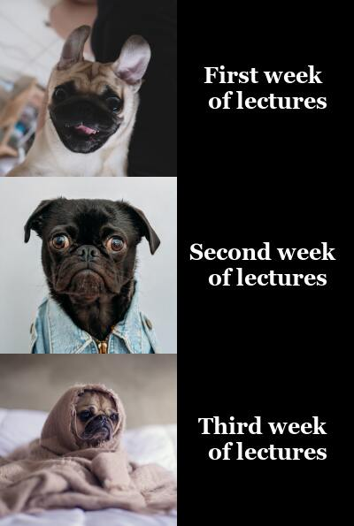

# My Meme Report



## About the Meme
This meme is based on popular meme formats and themes including:
- Panel based memes
- Memes where a situation gets progressively worse

### Some Example Formats


### Image Sources
The images used in my meme are from the website [Unsplash](https://unsplash.com/), which provides freely-usable images
1. [The first panel image](https://unsplash.com/photos/tnqOVFEskW8) by [James Tiono](https://unsplash.com/@jamestiono?utm_source=unsplash&utm_medium=referral&utm_content=creditCopyText)
  
2. [The second panel image](https://unsplash.com/photos/K4mSJ7kc0As) by [Charles Deluvio](https://unsplash.com/@charlesdeluvio?utm_source=unsplash&utm_medium=referral&utm_content=creditCopyText)
3. [The third panel image]() by [Matthew Henry](https://unsplash.com/@matthewhenry?utm_source=unsplash&utm_medium=referral&utm_content=creditCopyText)


## The Code

```r
library(magick)

# Import of Images

first_week <- image_read("https://images.unsplash.com/photo-1632669671776-cefd05baca87?ixlib=rb-1.2.1&ixid=MnwxMjA3fDB8MHxwaG90by1wYWdlfHx8fGVufDB8fHx8&auto=format&fit=crop&w=880&q=80")%>%
  image_rotate(180)%>%
  image_scale(200)

second_week <- image_read("https://images.unsplash.com/photo-1518020382113-a7e8fc38eac9?ixlib=rb-1.2.1&ixid=MnwxMjA3fDB8MHxwaG90by1wYWdlfHx8fGVufDB8fHx8&auto=format&fit=crop&w=717&q=80")%>%
  image_scale(200)%>%
  image_crop("200x200+0+60")

third_week <- image_read("https://images.unsplash.com/photo-1453227588063-bb302b62f50b?ixlib=rb-1.2.1&ixid=MnwxMjA3fDB8MHxwaG90by1wYWdlfHx8fGVufDB8fHx8&auto=format&fit=crop&w=1170&q=80")%>%
  image_crop("800x800+100")%>%
  image_scale(200)


# Join the dog images to create the first column of the meme

pug_vector <- c(first_week, second_week, third_week)
pug_image <- image_append(pug_vector, stack = TRUE)

# Create and join the second column that includes the caption panels

first_caption <- image_blank(width = "200", height = "200", color = "#000000")%>%
  image_annotate(text = "First week \n of lectures", color = "#ffffff", size = 25, gravity = "Center", font = "Georgia", weight = 700)

second_caption <- image_blank(width = "200", height = "200", color = "#000000")%>%
  image_annotate(text = "Second week \n of lectures", color = "#ffffff", size = 25, gravity = "Center", font = "Georgia", weight = 700)

third_caption <- image_blank(width = "200", height = "195", color = "#000000")%>%
  image_annotate(text = "Third week \n of lectures", color = "#ffffff", size = 25, gravity = "Center", font = "Georgia", weight = 700)


caption_vector <- c(first_caption, second_caption, third_caption)
caption_image <- image_append(caption_vector, stack = TRUE)

# Combine the two columns to create the final meme

combined_meme <- c(pug_image, caption_image)
final_meme <- image_append(combined_meme)

image_write(final_meme, "my_meme.png")
```

  
  


